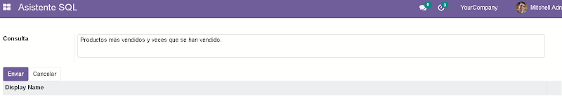
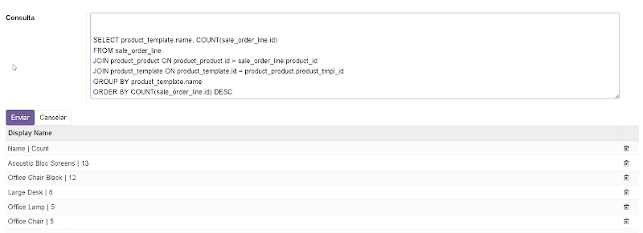

# Odoo AI to SQL Assistant Addon

This open-source project is an addon for the ERP/CRM [Odoo](https://www.odoo.com/). The addon uses [OpenAI](https://www.openai.com/) to assist in generating SQL queries based on natural language inputs.

## Project Overview

The addon works by allowing you to input a question in natural language about your data stored in the Odoo database. [ChatGPT](https://www.openai.com/research/chatgpt), an advanced language model developed by OpenAI, generates a SQL query based on your question and runs the query against your database. The results are then returned to you.

This process is facilitated by a `create.sql` script, which contains the structure of the basic tables in Odoo. This file is also provided to ChatGPT, enabling the language model to understand the structure of your database and generate accurate queries.

However, please note that this addon may not be able to generate queries for tables not covered in the `create.sql` file.

## Screenshots

## Getting Started

This section will guide you on how to install and use this addon in your Odoo instance.

### Prerequisites

You will need an instance of [Odoo](https://www.odoo.com/) running on your system. If you don't have one, please follow the official Odoo [documentation](https://www.odoo.com/documentation) to install it.

### Installation

Copy the `addon/ai_assistant` folder into your Odoo's custom addons folder and then there will be in the applications section of your Odoo platform. 

## Contributing

Contributions to this project are welcomed. If you have a feature request or find a bug, please open an issue. If you wish to contribute code, please open a pull request.

## License
